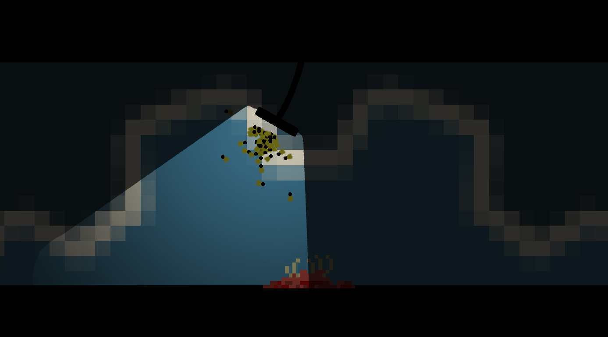

# Bugoids2D
2D Boids implementation in Godot Game Engine.

This is a very simple implementation of 2d Boids in Godot. There are some minor additional assets to create the scene, such as a swinging lamp and a carcass.

